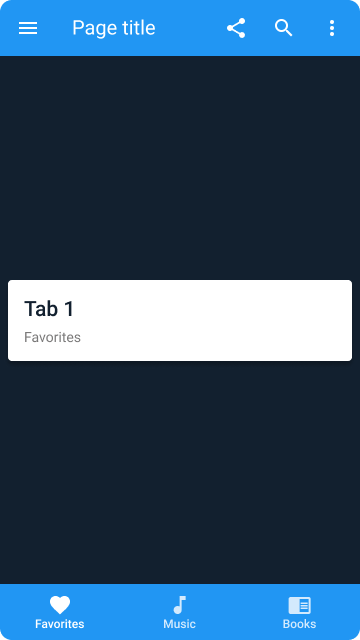

# UI Design & Build
Building UI components using lvl1 Widgets or Out-of-the-box Flutter widgets.

## How to Build the UI Components in this Project
Open Dartpad - an online editor for Dart and Flutter: 
https://dartpad.dev/?null_safety=true&id

Follow these steps:
1. Select "New Pad"
2. Choose Flutter and click "Create"
3. Open a UI component from this project (i.e. ui_components/lvl1_widgets/app_bar.txt)
4. Copy and Paste code from the .txt file to Dartpad
5. Select "Run"

## Screenshots (i.e. Full Demo)

  

## Resources
* [Flutter API](https://api.flutter.dev/)

* [Level 1 Widgets](https://docs.google.com/document/d/1dWFiGKUFVATSy-y_Il7X9S_d2_9IHJyfx_i_f6wPJOk/edit#heading=h.bw9fcp90sxta)

* [Figma UI Components](https://www.figma.com/file/MF5RiFSf33pdMRwXnrRbr7/UI-Design-and-Build)
